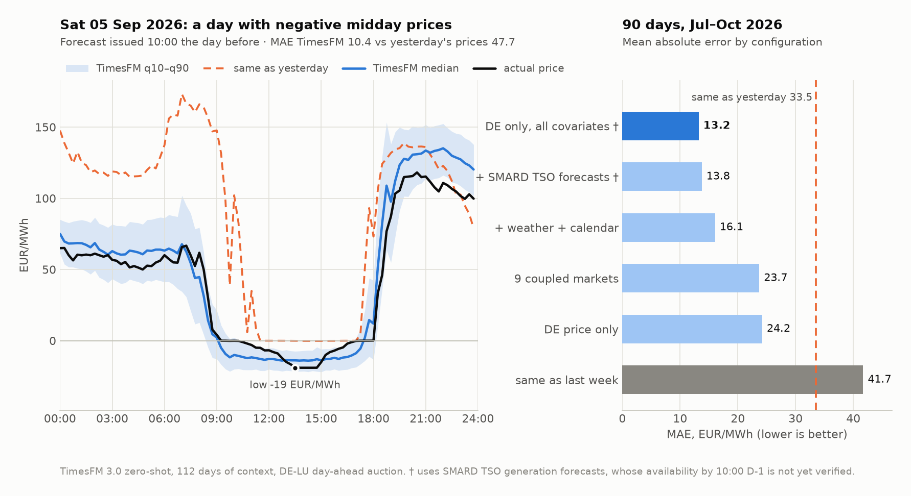
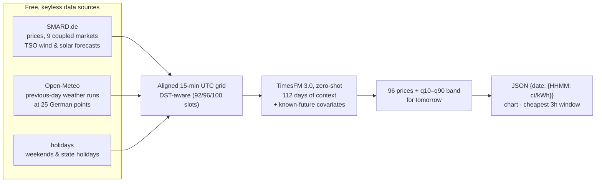
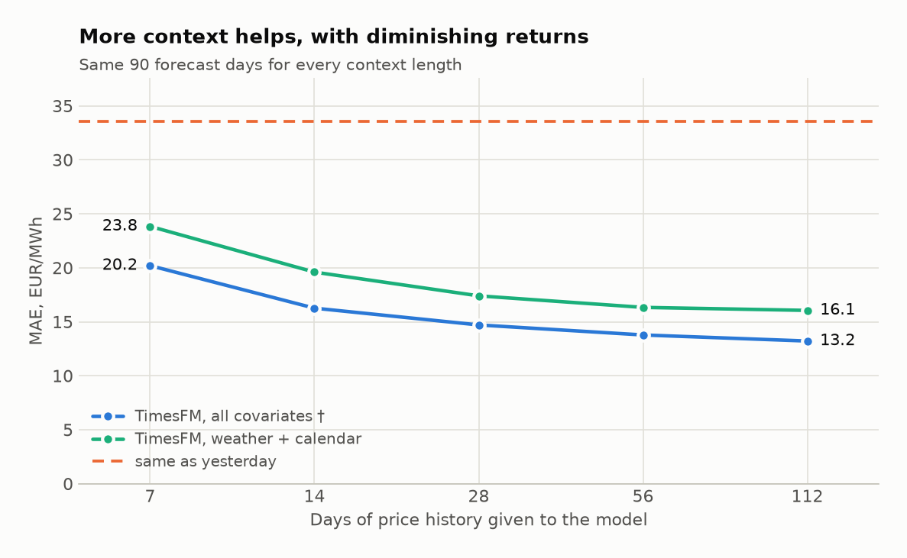
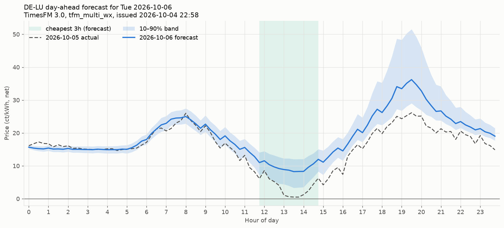

# Forecasting German power prices with TimesFM 3.0

**Can a general-purpose time-series foundation model forecast tomorrow's electricity prices,
zero-shot, with no training at all?** This repo is an experiment, an investigation and a
working MVP that does this for the German day-ahead market.

[](https://github.com/velaia/timesfm-power-prices/actions/workflows/ci.yml)


[](LICENSE)

> ### At a glance
>
> - **Roughly halves the error of the naive benchmark.** Over 90 days, the model scores an MAE
>   of **13.2 EUR/MWh**, against 33.5 for "same as yesterday" (−61%). It beats that benchmark
>   on **91% of days**.
> - **Covariates do the heavy lifting.** Weather plus TSO generation forecasts cut the error
>   from 24.2 to 13.2. Co-forecasting 8 neighbouring markets, TimesFM 3's headline
>   multivariate feature, barely helps (24.2 → 23.7).
> - **Useful in practice.** The forecast's cheapest 3-hour window lands within 30 minutes of the
>   real one on **86% of days**. "Same as yesterday" manages 66%.
> - **Cheap.** About 1 second per forecast on a MacBook GPU ([performance notes](docs/PERFORMANCE.md)), and every data source is free and keyless.
> - **Honest caveat.** Without the TSO forecasts, whose 10:00 availability is still being
>   verified, the guaranteed leak-free score is **16.1 (−52%)**.

<picture>
  <source media="(prefers-color-scheme: dark)" srcset="docs/hero_dark.png">
  
</picture>

## Why 10:00 on the day before?

The prices for each quarter hour of tomorrow are set in the EPEX day-ahead auction, which closes
at about 12:00 and publishes at about 13:00. A forecast is only useful if it arrives *before*
that, for example to plan tomorrow's dishwasher run, EV charging or heat-pump schedule, or to
decide whether to bid at all.

Every forecast in this repo is therefore issued **at 10:00 local time on D-1**. It predicts
all **96 quarter-hour prices** of day D for the DE-LU bidding zone, and uses only data that
exists at that moment.

## How it works



- **Model:** [`google/timesfm-3.0-pytorch`](https://huggingface.co/google/timesfm-3.0-pytorch)
  is used as-is, with no fine-tuning.
- **Context:** the model gets 112 days of quarter-hour prices, optionally together with the
  prices of 8 coupled neighbour markets.
- **Covariates:** these are series whose future values are already known at issue time:
  - previous-day weather forecasts, condensed into German-wide irradiance, wind
    capacity-factor and temperature features,
  - the TSO generation forecasts,
  - calendar flags.
- **Output:** median and quantile forecasts for each quarter hour.

## Results

Rolling-origin backtest over **90 forecast days (2026-07-08 .. 2026-10-05)**, with every day
forecast as of 10:00 on D-1. Prices in this period averaged 131.7 EUR/MWh, and 551 of the
8,640 quarter hours were negative. Errors are in EUR/MWh; divide by 10 for ct/kWh.

| Configuration | MAE | vs "same as yesterday" | Days beating it | Cheapest-3h hit |
|---|---:|---:|---:|---:|
| same as yesterday (`naive_d1`) | 33.5 | — | — | 66% |
| same as last week (`naive_d7`) | 41.7 | −24% | 39% | 54% |
| TimesFM, DE price only | 24.2 | +28% | 74% | 72% |
| TimesFM, 9 coupled markets | 23.7 | +29% | 76% | 72% |
| &nbsp;&nbsp;+ weather + calendar | 16.1 | +52% | 86% | 83% |
| &nbsp;&nbsp;+ SMARD TSO forecasts † | 13.8 | +59% | 90% | 88% |
| **TimesFM, DE only + all covariates †** | **13.2** | **+61%** | **91%** | 86% |

† Uses the SMARD TSO generation forecasts. See [the leakage caveat](#limitations-and-caveats).

The full table, with RMSE, negative-price recall and precision, pinball loss and band coverage,
plus more charts, is in **[docs/RESULTS.md](docs/RESULTS.md)**.



## What I learned

1. **Zero-shot works.** With the right covariates, a general foundation model that has never
   seen this market cuts the naive error by more than half. It does so without training,
   feature engineering beyond a few weather averages, or hyper-parameter search.
2. **Covariates matter more than the multivariate story.** TimesFM 3's headline feature is
   multivariate forecasting, but co-forecasting 8 coupled neighbour markets gains only 0.5
   EUR/MWh. Weather and generation forecasts do almost all the work. With all covariates, DE
   alone even beats the 9-market setup (13.2 vs 13.8).
3. **Longer context helps, with diminishing returns.** For the best config, MAE falls from
   20.2 (7 days) to 16.3 (14), 14.7 (28), 13.8 (56) and 13.2 (112).
4. **The forecast is useful even when its error isn't small.** It finds the cheapest 3-hour
   window on 86% of days, which matters more for planning a dishwasher run than the exact
   price does.

## Limitations and caveats

- **Leakage risk from the TSO forecasts.** SMARD keeps only the final vintage of the TSO
  generation forecasts. It is **not yet verified** that they are published by 10:00 on D-1.
  - The weather + calendar config (**16.1, −52%**) uses only previous-day Open-Meteo runs, so it
    is the guaranteed-honest number.
  - The live command falls back to that config automatically whenever the TSO forecasts for D
    aren't out yet.
  - Every live run logs TSO availability, which will settle the question over time.
- **Spikes get damped.** On 2026-09-14, the evening peak reached about 740 EUR/MWh and the
  forecast peaked at about 480. That day's MAE was 39.5, against 90.4 for the naive benchmark.
- **Negative prices are under-called.** The model catches only 57% of negative-price quarter
  hours. When it does forecast a negative price, it is right 88% of the time.
- **The uncertainty band is roughly calibrated.** The q10–q90 band covers 78% of actual
  prices, against a nominal 80%.
- **One market, one season.** The 90 days run from summer into autumn, a solar-heavy period.
  The 15-minute day-ahead market only started on 2025-10-01; earlier prices, which are hourly
  values repeated 4×, serve only as context.

## Live forecast on record

The `tomorrow` command produced this forecast for **Tue 2026-10-06** on Sun 2026-10-04 at
22:58, before the auction. Because SMARD hadn't published the TSO forecasts for D yet, it used
the weather-only fallback. It was also issued earlier than 10:00 D-1, so its weather inputs have
a longer lead time than in the backtest.

| Daily mean | Cheapest 3 h | Evening peak |
|---|---|---|
| 19.0 ct/kWh | 11:45–14:45 at ~9.5 ct/kWh | ~36 ct/kWh at 19:30 |



The files ([PNG](docs/forecast_on_record_2026-10-06.png), [JSON](docs/forecast_on_record_2026-10-06.json))
are committed unchanged, so the git history shows the forecast came before the result. The
comparison with the actual auction prices will be added once they are published.

## Quickstart

Requires [uv](https://docs.astral.sh/uv/) and Python 3.14. No accounts or API keys are needed.

```bash
git clone https://github.com/velaia/timesfm-power-prices && cd timesfm-power-prices
uv sync
uv run price-forecast fetch        # SMARD + Open-Meteo -> data/dataset.parquet (~1 min)
uv run price-forecast tomorrow     # forecast tomorrow's 96 prices (downloads the 1.2 GB model once)
uv run price-forecast backtest     # 90-day backtest, ~8 min on Apple silicon
uv run price-forecast figures      # rebuild the charts in docs/
```

`tomorrow` prints an hourly table with the cheapest 3-hour window. It writes
`outputs/forecast_<date>.json`, which holds median, q10 and q90 as `{date: {HHMM: ct/kWh}}`,
and a PNG chart.

The backtest is deterministic. To reproduce the published window after fetching newer data,
pass `--end 2026-10-05`. CLI flags, config definitions, data columns and inference settings
are documented in **[docs/USAGE.md](docs/USAGE.md)**.

Tests run offline, with no network and no model download: `uv run pytest`.

## Data sources

- **[SMARD.de](https://www.smard.de)**, Bundesnetzagentur: day-ahead prices for DE-LU and 8
  coupled zones, and the TSO generation forecasts.
  Data © Bundesnetzagentur | SMARD.de, [CC BY 4.0](https://creativecommons.org/licenses/by/4.0/).
- **[Open-Meteo](https://open-meteo.com)**: the Previous Runs API supplies the weather
  forecasts as they were issued the day before.
  Weather data by Open-Meteo.com, [CC BY 4.0](https://creativecommons.org/licenses/by/4.0/).
- **[`holidays`](https://github.com/vacanza/holidays)**: German public holidays by state.
- **[TimesFM 3.0](https://huggingface.co/google/timesfm-3.0-pytorch)**: Google Research.

## License

The **code** in this repository is released under the [MIT License](LICENSE).

The **TimesFM 3.0 model weights** are *not* part of this repository. They are downloaded at
runtime from Hugging Face and are licensed by Google under the **TimesFM Non-Commercial License
v1.0**. Check that license before using the forecasts commercially.

This is an experiment, not trading or financial advice.
