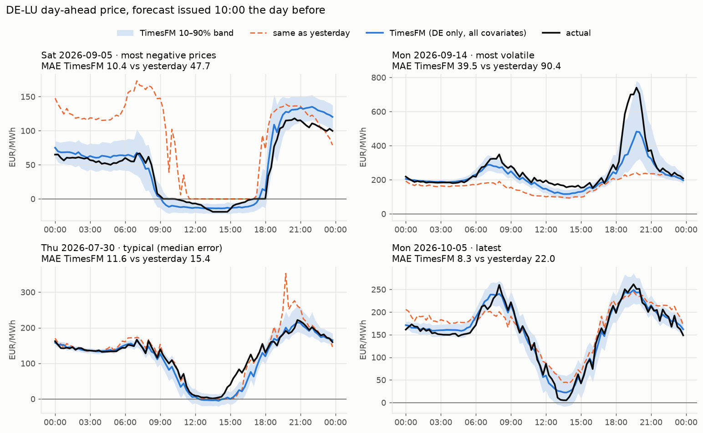
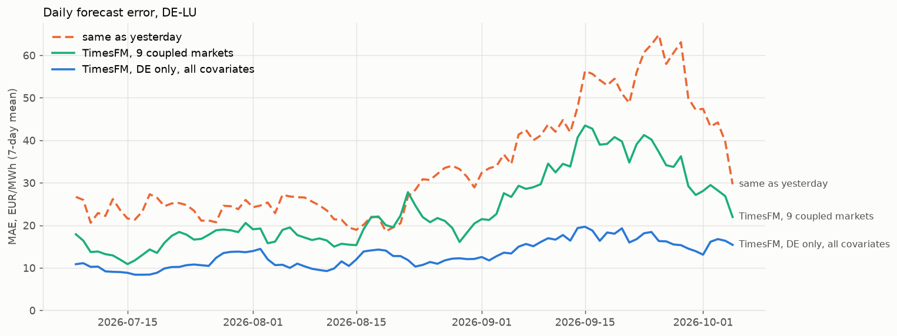

# Backtest results — 2026-10-04

TimesFM 3.0 (`google/timesfm-3.0-pytorch`), zero-shot, forecasting the 96 quarter-hour DE-LU
day-ahead prices of day D as of **10:00 on D-1**.

- **Period:** 90 forecast days, 2026-07-08 .. 2026-10-05
- **Context:** 112 days (10,752 quarter hours)
- **Device:** Apple-silicon GPU (MPS)
- **Prices in the period:** mean 131.7 EUR/MWh, std 73.7, 551 of 8,640 quarter hours negative

Reproduce with `uv run price-forecast fetch && uv run price-forecast backtest --end 2026-10-05`
(and `--context-days 7|14|28|56` for the context table). Rebuild the charts below with
`uv run price-forecast figures`.

Back to the [README](../README.md) · CLI and data reference: [USAGE.md](USAGE.md)

## Main table (context 112 days)

| Config | What | MAE | RMSE | vs d-1 | days beating d-1 | 3h regret | 3h hit | neg recall | neg precision | 80% band coverage | pinball | s/day |
|---|---|---|---|---|---|---|---|---|---|---|---|---|
| `naive_d1` | same as yesterday | 33.54 | 53.06 | — | — | 2.07 | 66% | 43% | 42% | — | — | — |
| `naive_d7` | same as last week | 41.70 | 62.20 | −24% | 39% | 3.39 | 54% | 54% | 44% | — | — | — |
| `tfm_de` | DE price only | 24.21 | 38.01 | +28% | 74% | 1.04 | 72% | 34% | 83% | 77% | 9.52 | 0.16 |
| `tfm_multi` | 9 coupled markets | 23.71 | 37.30 | +29% | 76% | 1.06 | 72% | 36% | 86% | 76% | 9.32 | 0.82 |
| `tfm_multi_wx` | + weather + calendar | 16.06 | 25.88 | +52% | 86% | 0.60 | 83% | 44% | 86% | 77% | 6.33 | 1.40 |
| `tfm_multi_wx_tso` | + SMARD TSO forecasts | 13.75 | 21.97 | +59% | 90% | 0.52 | 88% | 52% | 86% | 77% | 5.46 | 1.74 |
| `tfm_de_wx_tso` | DE only, all covariates | **13.22** | **20.90** | **+61%** | **91%** | 0.57 | 86% | 57% | 88% | 78% | **5.24** | 1.04 |

Errors in EUR/MWh.

- **vs d-1:** reduction in mean daily MAE compared with `naive_d1`.
- **3h regret:** how much more expensive (mean price, EUR/MWh) the forecast's cheapest 3-hour window
  really was than the true cheapest window.
- **3h hit:** share of days where the forecast's cheapest window starts within 30 minutes of the true one.
- **neg recall / precision:** for slots with price < 0.

## Context length (MAE, EUR/MWh)

| Context days | `tfm_multi_wx` | `tfm_multi_wx_tso` | `tfm_de_wx_tso` |
|---|---|---|---|
| 7 | 23.84 | 21.07 | 20.20 |
| 14 | 19.60 | 17.14 | 16.27 |
| 28 | 17.40 | 15.42 | 14.71 |
| 56 | 16.34 | 14.27 | 13.78 |
| 112 | 16.06 | 13.75 | 13.22 |

With 28 days of context, `tfm_de` scored 25.44 and `tfm_multi` 24.37.

## Findings

1. **Covariates matter far more than co-forecasting the neighbours.** Adding the 8 coupled
   markets barely helps (24.2 → 23.7), while weather + calendar cut the error by a third and the
   TSO generation forecasts cut it further. With all covariates, DE alone beats the 9-market setup.
2. **`tfm_multi_wx` (16.1) is the safe number for a 10:00 run.** Its weather inputs are
   previous-day Open-Meteo runs, which exist at issue time. SMARD keeps only the final vintage of the
   TSO forecasts, so it is not yet verified that they are published by 10:00 on D-1.
3. **Longer context keeps helping,** with diminishing returns beyond ~56 days.
4. **Price spikes and deep negatives get damped.** On the most volatile day (2026-09-14) the evening
   peak reached ~740 EUR/MWh; the forecast peaked at ~480 (with 28 days of context only ~310). Slots predicted negative are right 88% of
   the time, but only 57% of negative slots are caught.
5. **The quantile band is roughly calibrated:** the q10–q90 band covers 76–78% of the actual prices,
   against a target of 80%.

## Setup notes

- **Data:** SMARD.de for prices (9 zones) and TSO generation forecasts; Open-Meteo Previous Runs
  (`*_previous_day1`) at 25 points for irradiance, wind power-curve proxy and temperature;
  `holidays` for calendar flags. See the README.
- **Negative prices:** `TimesFM3Evaluator.predict_batch` defaults to `make_positive=True`, which
  clamps forecasts at 0. It is switched off here.
- **Inference settings:** symmetric averaging stays on (the evaluator default). Covariates are
  edge-padded because the 96-slot horizon is rounded up to the 128-step output patch.
